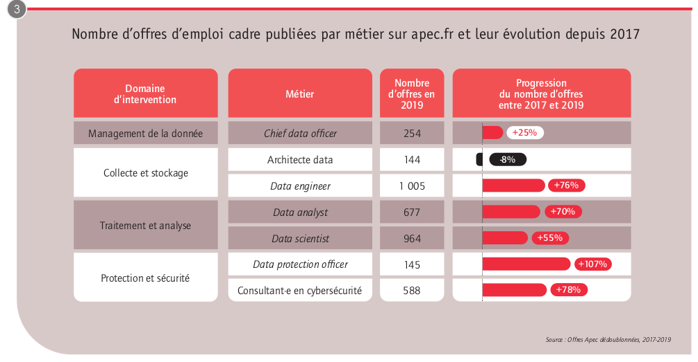
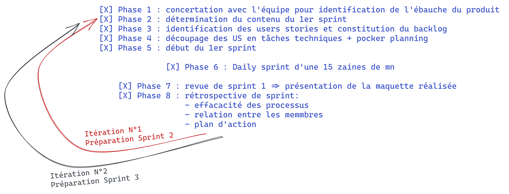

# Documents de réflexion et de conception

> Analyse de l'emploi dans le secteur de la Data

## PRESENTATION GENERALE
### Projet:
- **Description Sommaire** : Livrer des visuels (tableaux de bords - cartographie) au client, qui vont lui permettre d'analyser quotidiennement les offres d'emploi dans le secteur de la Data
- **Type** : cartographie et Tableau de bord accessible en ligne mis à jour quotidiennement.
- **Equipe en charge du developpement du projet** : Hamida, Moncef (SM), François, François (PO).

     

## Sommaire
1. [Introduction](#id-Introduction)
2. [Objectifs](#id-Objectifs)
3. [Gestion du Projet](#id-Projet)
     3. [Organisation](#id-Organisation)
     3. [Outils](#id-Outils)
     3. [Déroulement du Projet](#id-Projet)
     3. [Problèmes rencontrés et plan d'action](#id-Plan)
4. [Recherche d'information](#id-Partie1)
     4. [Les métiers de la Data](#id-DataE)
5. [Analyse des sources proposées dans le brief](#id-Partie2)
     5. [Site Pôle Emploi](#id-APIpe)
     5. [Site Monster](#id-Monster)
     5. [Web Scraping](#id-Scrap)
6. [Sources et liens utiles](#id-Liens)

### Introduction

Chiffres clés 

*Source APEC*

### Objectifs

- Comprendre les spécificités de l'emploi dans le secteur de la Data (quelles sont les compétences indispensables pour trouver un emploi dans la Data ?).
- Analyser le marché de l'emploi en ligne dans le secteur de la Data (en utilisant les ressources proposées dans le brief).
- Proposer un outils qui permettra de collecter et d'analyser automatiquement les offres d'emploi dans le secteur de la Data. 
- Les visuels seront sous la forme de Dashboard - Cartographie (présentants des métriques définis avec le client, accessible en ligne sous la forme d'une page Web). 

### Gestion du Projet

  

- #### **Répartition des rôles**
 2 rôles ont été identifiés (PO et SM), le projet étant de petite envergure et l'équipe novice en matière de gestion de projet, nous avons opté pour une organisation flexible, ou chacun pouvait intervenir dans l'organisation.
 
- #### **Préparation**
Nous nous sommes inspirés de la méthode Agile pour la gestion de projet ainsi que du Framework Scrum pour le découpage du projet en sprint.

                                   **ITERATIONS SCRUM**

- #### **Outils**
  

+ Utilisation Discord pour la communication et l'échange d'information
+ Utilisation de Trello (outil de gestion de projet en ligne) pour la partie [scrum board](https://trello.com/b/OXOmkgoO/datajobdaschboard)
+ Utilisation d'un document partagé entre tous les membres de l'équipe [google Doc](https://docs.google.com/document/d/1jopN1tvcTr9IwDayvoAWEiReBuXUZ8_c8VHRyI56kwk/edit)
+ Utilisation d'un tableur pour la visualisation des données [google Sheet](https://docs.google.com/spreadsheets/d/1yBM06URmG2SkiGx-3BmXYcS75fwE676THl478rx4zjA/edit?usp=sharing)
+ Utilisation de Docker pour la partie conteneur
+ Utilisation du SGBD PostgreSQL pour la création de database
+ Utilisation de Jupyter Notebook pour les phases de tests et de conception de code

+ Utilisation de Gitlab CI / CD pour la construction et la publication de la page Web statique  

- #### **Déroulement du Projet**
  

  
**Planning** Les rendez-vous projets :
     
      [X] Lundi 1er février   : lancement du projet
      [X] Mercredi 3 février  : maquette du tableau de bord, product backlog, organisation agile, sprint planning et lancement du premier sprint
      [X] Mercredi 10 février : revue de sprint + retrospective de sprint
      [X] Mercredi 17 février : revue de sprint + retrospective de sprint
      [ ] Mercredi 24 février : revue de projet + retrospective de projet

Le projet s'est décomposé en plusieurs itérations:

- #### **Problèmes rencontrés et plan d'action**

>  il faut beaucoup de temps pour gagner la confiance et seulement quelques secondes pour la perdre.
  
  Nous avons été confrontés aux aléas du projet :

           |          pbm rencontrés (les -)              |         phase d'identification           |               plan d'action                             |
           | ---------------------------------------------|------------------------------------------|---------------------------------------------------------|
           |    gestion ressources humaines               |           lancement du projet            |         intervention équipe encadrement Simplon         |
           |    problèmes organisationnels                |           Sprint review                  |         meilleurs découpage des tâches techniques       |     
           |    problèmes de communication                |           rétrospective                  |         respecter les sprint daily                      |
           |    problèmes de partage d'information        |           rétrospective                  |         respecter l'utilisation de GIT (+ de synchro)    |
           |                                              |                                          |                                                         |
           |--------------------------------------------- |------------------------------------------|---------------------------------------------------------|
           |          Réussite   (les +)                  |          phase d'identification          |                                                         |
           |                                              |                                          |                                                         |
           |    l'équipe s'est toujours remobilisée       |            retrospective                 |                                                         |
           |    l'équipe a su se remettre en question     |                                          |                                                         |
           |    l'équipe est montée en compétence         |                                          |                                                         |

- #### **Conclusion**

Il a manqué un rôle de Chef de projet pour une gestion plus rigoureuse du projet et la mise en place de règles.

Lors des revues de sprint nous avons mis en évidence les différents problèmes rencontrés, nous avons  afiner les US et reconsidérer les livrables.
Lors des rétrospectives de sprint nous avons pu échanger au sein de l'équipe et déterminer des plans d'action.

### Recherche d'information

Comprendre les spécificités de l'emploi dans le secteur de la Data (quelles sont les compétences indispensables pour trouver un emploi dans la Data ?)

Les métiers de la data :  
Les entreprises ont besoin de mobiliser des compétences spécifiques pour tirer profit au mieux des données.
Celles-ci relèvent de trois champs distincts : celui de la **`collecte`** et du **`stockage`** des données, celui du **`traitement`** et de la **`modélisation`** des données et celui de la **`protection`** et la **`sécurité`** des données.

Le métier préparé par la formation SIMPLON se situe entre le ``DATA ENGINEER`` et le ``DATA ANALYST``

Lors de l'élaboration des différentes US, nous avons décidé de filtrer les offres d'emploi sur 4 catégories de métiers liées à la Data :
Data Engineer - Développeur·euse Data - Data Analyst - Data Scientist

       |               |              Data Engineer               |         Data Analyst                           |    Data Scientist                                 |
       | ------------- |------------------------------------------|------------------------------------------------|---------------------------------------------------|   
       |               |                                          |                                                |                                                   | 
       |  intitulé     |     Ingénieur·e data/big data            |      Analyst dataminer                         |    Ingénieur·e data scientist                     |
       |  secondaire   |     `Développeur·euse data`              |      Chargé·e d’études en datamining           |                                                   |
       |               |     Machine learning engineer            |      Consultant·e dataminer                    |                                                   |
       |               |     Ingénieur·e en développement         |                                                |                                                   |
       |               |     big data                             |                                                |                                                   |
       |               |                                          |                                                |                                                   |
       |               |                                          |                                                |                                                   |
       |  mots clés    |     #développement informatique          |       #bases de données                        |     #bases de données                             |
       |               |     #système d’information               |       #analyse et modélisation des données     |     #machine learning                             |
       |               |     #structuration de la donnée          |       #data visualisation                      |     #intelligence artificielle                    |
       |               |     #big data                            |                                                |     #modèles statistiques                         |
       |               |                                          |                                                |                                                   |
       |               |                                          |                                                |                                                   |
       |  activité     |     Acheminement de la donnée            |        Extraire les données nécessaires à      |     Extraction et structuration des données       |
       |  principale   |     mise à disposition des données       |        l’analyse (Web scraping, API, etc.)     |     Extraire les données nécessaires à  API, etc.)|
       |               |     aux équipes utilisatrices            |        Analyse et exploration des données      |     l’analyse (Web scraping,                      |
       |               |     mise en production de modèles        |        Réaliser des tableaux de bord ou        |     Elaboration des algorithmes d’intelligence    |
       |               |     statistiques dans les applications   |        des outils de reporting industrialisés  |     Industrialisation des modèles                 |
       |               |     artificielle dans les applications   |        Communication avec les équipes clientes |                                                   |
       |               |     suivi des projets de développement   |                                                |                                                   |
                               
          

### Analyse des sources proposées dans le brief

  

   - #### **Site Pôle Emploi** 
Le site référence d'offres d'emploi, il s'agit du site d'emploi généraliste le plus visité en France.

En effectuant des recherche, le site [Python Package Index](https://pypi.org/) fourni une interface Python pour l'API "Offres d'emploi V2" [API de recherche d'emploi de Pôle Emploi](https://pypi.org/project/api-offres-emploi/)

Les tests effectués avec l'API Pôle emploi ne nous ont pas permis de valider son utilisation, assez complexe à configurer dans le temps imparti.

   - #### **Site Monster** 
   Monster est un site généraliste:
   
      [X] Types d’offre : généralistes. Métiers les plus représentés : informatique, finance, commerce, marketing.  
      [X] Types de contrat : tous. Le filtre « type de contrat » propose aussi une vue par temps plein ou temps partiel.  
      [X] Nombre d’offres disponibles : + de 12.000

Les tests effectués sur le site Monster ont été concluants, nous avons décidé de nous focaliser sur ce site et d'utiliser le Web scraping pour la collecte de donnée:  

[url scrap monster](https://www.monster.fr/emploi/recherche/?q=data&where=Auvergne__2DRh__C3__B4ne__2DAlpes&cy=fr)      

 - #### Conditions d'utilisation    

Monster n'autorise pas le Web Scraping, extrait des CGU:
>>>                               
Les utilisateurs s’interdisent :

(x) d’utiliser un autre logiciel de navigation ou de recherche que les outils disponibles sur le site Monster, les navigateurs web tiers généralement disponibles de tiers ou autres outils autorisés par Monster ;

(x) utiliser des systèmes d’exploration de données (data mining), des robots ou tout autre méthode semblable pour la collecte et l’exploitation de données ;
>>>

> Nous utiliserons le Web Scraping uniquement à des fins pédagogiques ainsi que pour creer une valeur nouvelle à la données et pas pour la dupliquer.

- #### **Web Scraping**

+ **Arguments contre:** 
Cela permet de récupérer le contenu d’une page web en vue d'en réutiliser le contenu. Cette opération se pratique le plus souvent de façon automatique, qui permet de constituer des pages à bon compte. Cette pratique n'a pas très bonne presse chez les contributeurs authentiques car elle peut être assimilée à un pillage.   

+ **Arguments pour:**
Dans un cadre entreprise, qui est elle bien sûr propriétaire de ses données, cette technologie permet de réduire significativement le temps et le coût des intégrations d'applications d'entreprise. Bien que ce type d'intégration ait été dans le passé dénigré pour son manque de fiabilité et de performance, il existe aujourd'hui sur le marché des outils professionnels qui permettent ces intégrations dans le respect des contraintes de sécurité et de gouvernance imposées par les grandes entreprises.

+ **En Europe:**
Dans un jugement de 2013, la cour de justice de l'Union européenne a condamné le métamoteur de recherche Innoweb, qui réutilisait les données de l'entreprise de vente d'automobiles Wegener sans aucune modification de celles-ci.
Le 30 avril 2020, la CNIL a publié de nouvelles directives sur le web scraping5. Les lignes directrices de la CNIL précisent que les données accessibles au public sont toujours des données personnelles et qu'elles ne peuvent pas être réutilisées à l'insu de la personne à laquelle ces données appartiennent6.
Les Conditions d'utilisation:

+ **Bonnes pratiques:**

    [Web Scraping bonnes pratiques](https://practicalprogramming.fr/scraping-conseils-et-bonnes-pratiques/)

### Déploiement GitLab CI/CD

GitLab CI/CD est une fonctionnalité de GitLab qui permet de mettre en place des pipelines de CI/CD pour n'importe quel projet,

### Sources et liens utiles

+ [CGU Monster](https://www.monster.fr/donnees/conditions-utilisation) 
+ [Web scraping](https://fr.wikipedia.org/wiki/Web_scraping)
+ [les principaux site de recherche d'emploi](https://www.aide-sociale.fr/site-offre-d-emploi/)
+ [Les métiers de la data](https://corporate.apec.fr/home/nos-etudes/toutes-nos-etudes/les-metiers-de-la-data.html)
+ [La Dares est l’un des principaux producteurs de données statistiques sur le travail, l’emploi et la formation professionnelle.](https://dares.travail-emploi.gouv.fr/donnees)
+ [Compétences indispensable pour un data scientist](https://www.tableau.com/fr-fr/learn/articles/data-science-skills)

