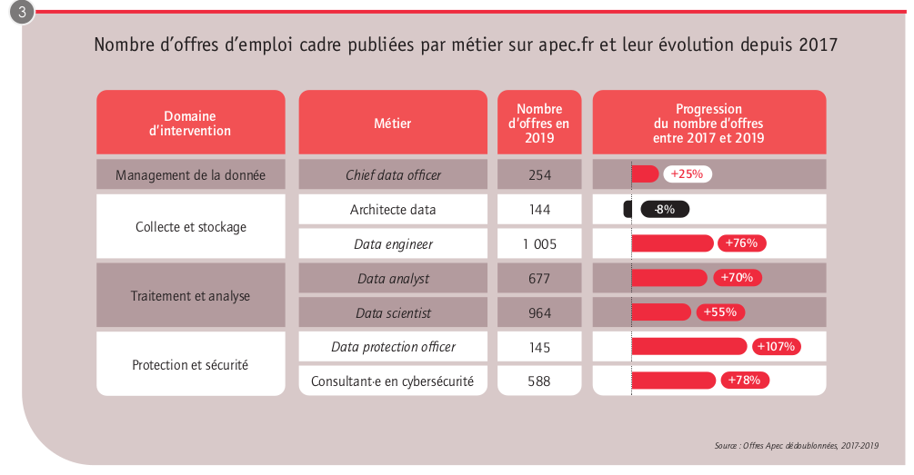

Documents de réflexion et de conception [v1.0, 2021-02-06] 

# Documents de réflexion et de conception

> Analyse de l'emploi dans le secteur de la Data

## PRESENTATION GENERALE
### Projet:
- **Description Sommaire** : Livrer des visuels (tableaux de bords - cartographie) au client, qui vont lui permettre d'analyser quotidiennement les offres d'emploi dans le secteur de la Data
- **Type** : cartographie et Tableau de bord accessible en ligne mis à jour quotidiennement.
- **Equipe en charge du developpement du projet** : Hamida, Moncef (SM), François, François (PO).
- **Planning** Les rendez-vous projets :
     >>>
      [X] Lundi 1er février   : lancement du projet
      [ ] Mercredi 3 février  : maquette du tableau de bord, product backlog, organisation agile, sprint planning et lancement du premier sprint
      [ ] Mercredi 10 février : revue de sprint + retrospective de sprint
      [ ] Mercredi 17 février : revue de sprint + retrospective de sprint
      [ ] Mercredi 24 février : revue de projet + retrospective de projet
     >>>

## Sommaire
1. [Introduction](#id-Introduction)
2. [Objectifs](#id-Objectifs)
3. [Gestion du Projet](#id-Projet)
     3. [Organisation](#id-Organisation)
         3. [Risques](#id-Risques)
     3. [Outils](#id-Outils)
4. [Partie 1 : recherche d'information](#id-Partie1)
     4. [Data Engineer](#id-DataE)
     4. [Data Analyst](#id-DataA)
5. [Partie 2 : analyse des sources proposées dans le brief](#id-Partie2)
     5. [API Pôle Emploi](#id-APIpe)

### Introduction

Chiffres clés 

*Source APEC*

### Objectifs

- `Comprendre les spécificités de l'emploi dans le secteur de la Data (quelles sont les compétences indispensables pour trouver un emploi dans la Data ?).`
- `Analyser le marché de l'emploi en ligne dans le secteur de la Data en utilisant les ressources proposées dans le brief.`
- `Proposer un outils qui permettra de collecter et d'analyser automatiquement les offres d'emploi dans le secteur de la Data.` 
- `Les visuels seront sous la forme de Dashboard - Cartographie présentants des métriques définis avec le client, accessible en ligne sous la forme d'une page Web.` 

### Gestion du Projet

  

   - #### **Préparation**
La gestion de projet suit la méthodologie SCRUM, nous avons définis plusieurs étapes pour le lancement du projet
 ### Scrum Board
   

      - ##### **Scrum [¹](#id-1)**
Utilisation de Trello pour la partie [scrum board](https://trello.com/b/OXOmkgoO/datajobdaschboard)

      - ##### User Story Mapping

      - ##### Burndown Chart

>  [¹](#id-1)

Type des risques potentiels: Financiers, organisationnels, techniques, sociaux, environnementaux.

### Partie 1 : recherche d'information

Comprendre les spécificités de l'emploi dans le secteur de la Data (quelles sont les compétences indispensables pour trouver un emploi dans la Data ?)

Les métiers de la data :  
Les entreprises ont besoin de mobiliser des compétences spécifiques pour tirer profit au mieux des données.
Celles-ci relèvent de trois champs distincts : celui de la **`collecte`** et du **`stockage`** des données, celui du **`traitement`** et de la **`modélisation`** des données et celui de la **`protection`** des données.

Le métier préparé par la formation SIMPLON se situe entre le ``DATA ENGINEER`` et le ``DATA ANALYST``

### Data Engineer

intitulés secondaires:
Ingénieur·e data/big data * **Développeur·euse data** * Machine learning engineer * Ingénieur·e en développement big data
>>>
Le·la data engineer est un·e développeur·euse
informatique qui a pour mission de mettre en place la
collecte et la mise à disposition des données au sein de
l’entreprise. Il·elle est également en charge d’industrialiser
et mettre en production des traitements sur les données
(par exemple : mise à disposition de tableaux de bords,
intégration de modèles statistiques) en lien avec les
équipes métiers et les équipes qui les analysent.
`#développement informatique` `#système d’information` `#structuration de la donnée` `#big data`
>>>
*Source APEC*

**Activités principales**

Acheminement de la donnée 
mise à disposition des données aux équipes utilisatrices
mise en production de modèles statistiques dans les applications
suivi des projets de développement

**Activités éventuelles**

Automatiser la création de tableaux de bord aux équipes métiers (envoi de fichiers via des applications dédiées)
Assurer une veille technologique sur les outils big data
Écrire la documentation relative aux bases de données (règles de gestion, dictionnaire des variables, etc.)

### Data Analyst

Intitulés secondaires:
Analyst dataminer Chargé·e d’études en datamining Consultant·e dataminer
>>>
Le data analyst valorise l’ensemble des données d’une entreprise pour en faire un levier de création de valeur.
Il·elle utilise notamment les données recueillies en masse (big data) pour réaliser les nombreux tableaux de bord nécessaires à différents services de l’entreprise (marketing, relations clients, production...). Il·elle est également en charge de construire des modèles statistiques pour éclairer les services opérationnels (segmentations clients ou analyses prédictives).
`#bases de données #analyse et modélisation des données #statistiques #data visualisation`

**Activités principales**

Extraction et structuration des données
Extraire les données nécessaires à l’analyse (Web scraping, API, etc.)
Définir des règles de gestion de nettoyage des bases de données (formatage, suppression des doublons, etc.)
Définir des règles de gestion de structuration des différentes bases de données entre elles
Écrire et rédiger les spécifications d’automatisation des règles de gestion à la direction des systèmes d’information ou à la maîtrise d’ouvrage
Maîtriser la qualité des données tout au long de leur traitement

Analyse et exploration des données
Analyser les données : mettre en avant les corrélations, définir les valeurs aberrantes 
Réaliser des tableaux de bord ou des outils de reporting industrialisé.
Réaliser des tests statistiques sur les données
Construire et tester des modèles statistiques (régression, forêt aléatoire, etc.)
Déterminer ou construire les variables importantes à introduire dans les modèles statistiques

communication avec les équipes clientes
Participer aux ateliers d’expression des besoins internes
Comprendre précisément les problématiques métiers et les traduire de manière analytique
Communiquer les résultats et les solutions avec les équipes métiers
Présenter les résultats des anayses grâce à des outils de data visualisation

Veille technologique sur les outils d’analyse de données
Effectuer une veille sur les nouvelles technologies et solutions logicielles d’analyse des données
Rechercher et expérimenter de nouvelles méthodes de modélisation et d’analyse des données
Sélectionner les nouveaux outils et techniques d’analyse des données

**Activités éventuelles**

Les data analysts peuvent avoir la charge de la création de tableaux de bords, mais également la réalisation d’études statistiques
plus poussées. C’est le cas dans le secteur de la banque et de la finance pour l’élaboration d’algorithmes prédictifs, l’analyse et la prévention statistique des risques économiques (impayés, crédits, placements, etc.).

**Compétences techniques demandées:**

- Expertise en gestion de base de données (SQL, NoSQL, etc.)
- Maîtrise des systèmes d’exploitation (Unix, Windows, etc.)
- Maîtrise des tests et méthodes statistiques (segmentation,régression, forêt aléatoire, etc.)
- Maîtrise des langages de programmation (C++, Python, R, etc.)
- Maîtrise d’un outil de data visualisation (Tableau, Qlikview, PowerBI)
- Maîtrise des outils de fouille et analyse de données (Dataiku, etc.)
- Connaissance de l’environnement Hadoop

*Source APEC*

### Partie 2 : analyse des sources proposées dans le brief

  

   - #### **API Pôle Emploi** 
              
        En effectuant des recherche sur internet, le site [Python Package Index](https://pypi.org/) fourni une interface Python pour l'API "Offres d'emploi V2" [API de recherche d'emploi de Pôle Emploi](https://pypi.org/project/api-offres-emploi/)

L'API Offres d'emploi v2 comporte deux méthodes :

``recherche`` : elle retourne un comptage agrégé (appelé filtresPossibles) des offres d'emploi ainsi que la liste détaillée de ces offres d'emploi (appelée resultats). De nombreux paramètres sont disponibles : date, mots-clés, localisation, etc. De nombreuses informations sont disponibles sur la page du site Rechercher par critères.

``référentiel`` : source de référence de retour (plus d'informations sur la page du site Référentiels).
Sur la portée et la pagination : Dans la méthode de recherche, seules les 150 premières offres d'emploi sont retournées par défaut par l'API (puisque la valeur de la plage par défaut est 0-149). Il y a trois contraintes concernant le paramètre de plage (voir la référence pour le paramètre "plage") :

la valeur maximale pour le premier élément de la plage est de 1000
la valeur maximale pour le deuxième élément de la gamme est de 1149
le nombre de résultats pour une demande donnée doit être inférieur ou égal à 150

Ainsi, pour une recherche donnée, il est possible d'obtenir jusqu'à 1150 offres d'emploi, en modifiant la valeur de la plage de paramètres pour chaque demande (0-149 puis 150-299, 300-449, etc.). Toutefois, certaines recherches peuvent comporter bien plus que 1150 offres d'emploi. Dans ce cas, il faut affiner la recherche en utilisant des paramètres supplémentaires (par exemple : en jouant avec les paramètres minCreationDate et maxCreationDate de la demande).

Taux limite : Le taux limite de l'API est fixé à 3 demandes par seconde.

### Sources

[Les métiers de la data](https://corporate.apec.fr/home/nos-etudes/toutes-nos-etudes/les-metiers-de-la-data.html)

[La Dares est l’un des principaux producteurs de données statistiques sur le travail, l’emploi et la formation professionnelle.](https://dares.travail-emploi.gouv.fr/donnees)

[Compétences indispensable pour un data scientist](https://www.tableau.com/fr-fr/learn/articles/data-science-skills)

¹ [Memo Scrum (français)](https://)